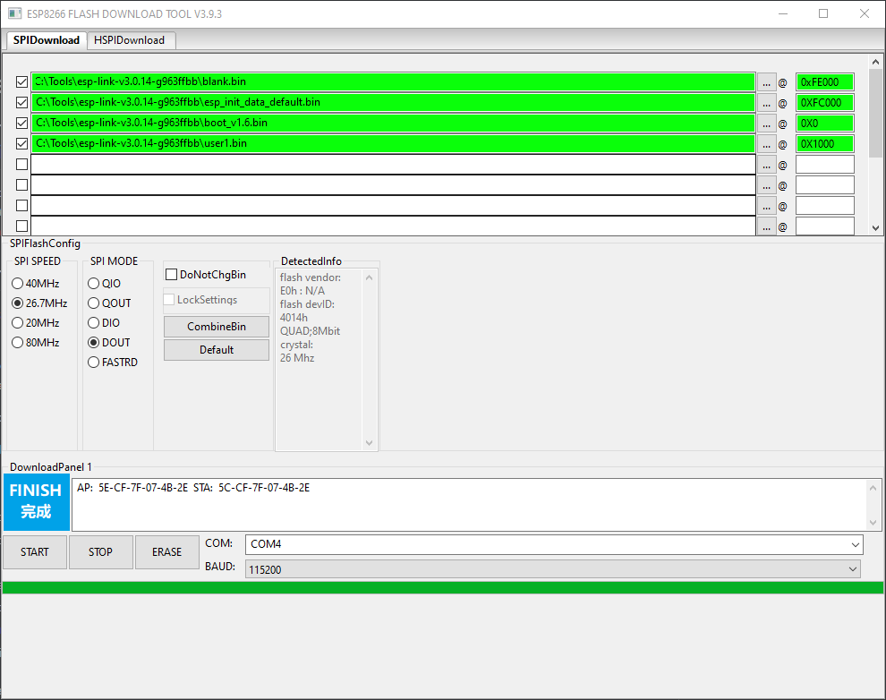
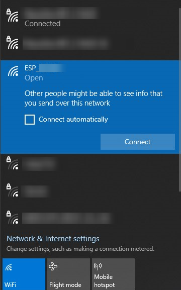
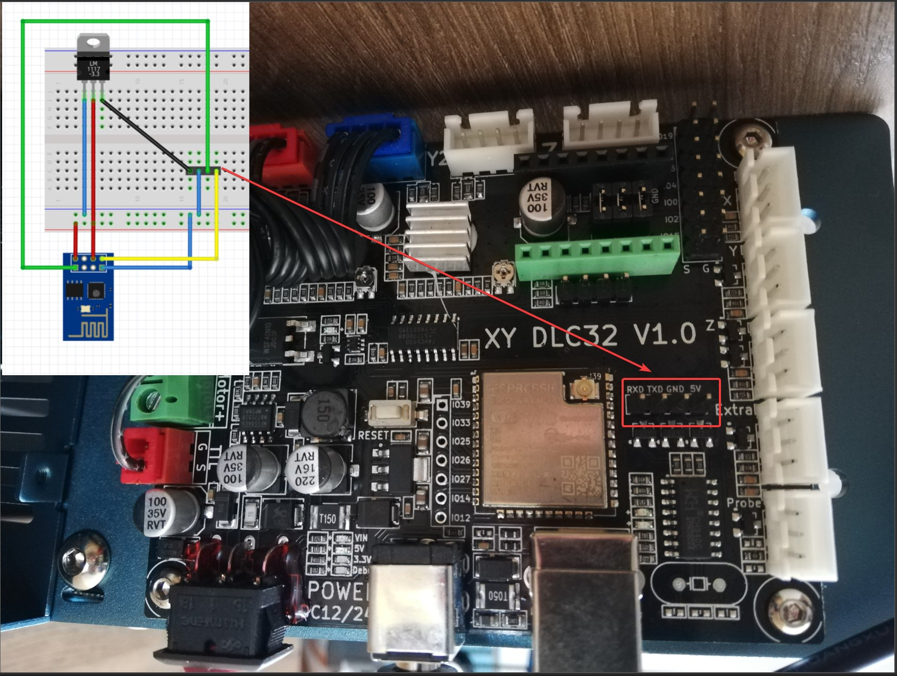
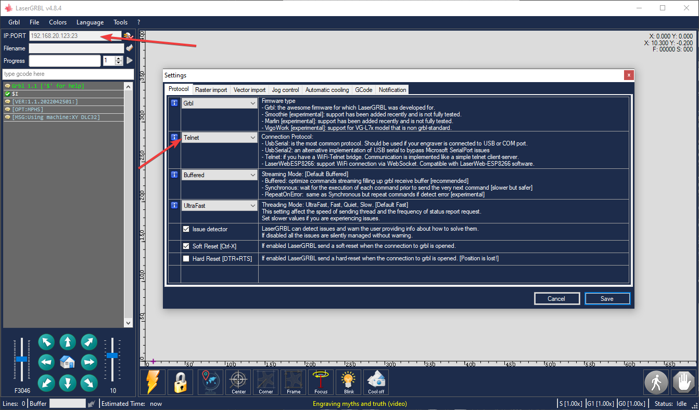

# How to add WIFI (With ESP-01)

1. Donwload flashing tools for ESP8266
    https://espressif.com/en/support/download/other-tools?keys=&field_type_tid%5B%5D=14
2. Download ESP-Link firmware 
    https://github.com/jeelabs/esp-link/releases
3. Flash the ESP (GPI0 <--> GND on connecting)

    |File |Addresses|
    |-----|---------|
    |blank.bin | 0xFE000|
    |esp_init_data_default.bin | 0XFC000|
    |boot_v1.6.bin | 0X0 |
    |user1.bin | 0X1000 |

    |Setting | Value|
    |-----|---------|
    |SPI SPEED | 26.7MHz|
    |SPI MODE | DOUT|
    |DoNotChgBin | Unchecked |
    |BAUD | 115200 |

    Actions:
    1) Erase
    2) START

    
4) Restart your ESP (CH_PD <--> VCC)
5) Connect to network ESP-*
    
    
6) Open http://192.168.4.1 in the web browser
7) Configure WIFI SSID & Password
8) Disable Debug logging to UART
9) Wire ESP to DLC32 as showed on the diagram 

    Use AMS1117 (LM1117) as a 5V -> 3.3V step down regulator

    

10) In LaserGRBL connect using Telnet (port 23)
    
    

> Remarks
 - I tried to used ESP-12 which can be power with 5V without any extra component. However, it's susceptible to hight level on `GPIO15` (UART switch mode)  during the boot so it's not working with Sculpfun S10 (you need to disconnect RX from the machine, power on and then connect RX back)
    
    
